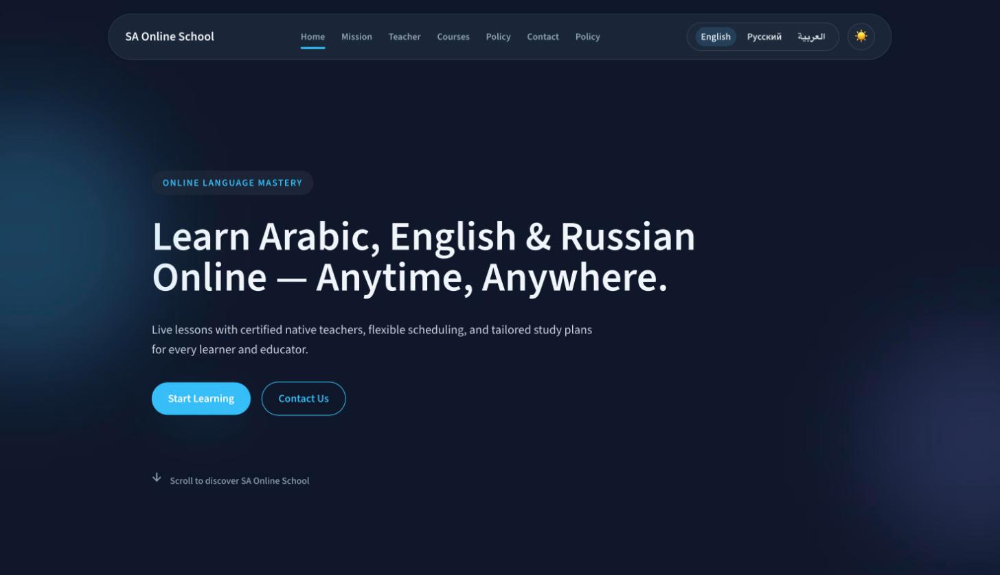

# SA Online School


Live demo: https://salama-malek.github.io/Sarah-Gerges/



A marketing and booking website for an online English and Arabic language school.

## Overview

SA Online School is a single-page marketing site built for Sarah Gerges' online language school. It presents the school's mission, course catalog, pricing, and study rules to prospective students, and gives visitors a way to get in touch. The site supports English, Russian, and Arabic (including right-to-left layout) and offers both light and dark themes.

## Features

- Multilingual UI (English, Russian, Arabic) with automatic RTL layout for Arabic
- Light/dark theme toggle with persisted preference
- Section-based landing page: hero, mission/features, about, courses, pricing, school rules, testimonials, and contact
- Client-side routing with a slide-in navigation drawer for mobile
- Animated section transitions and lazy-loaded sections for fast initial load
- Reusable UI primitives (buttons, cards, accordion, modal, inputs)

## Tech stack

- React 19 + TypeScript
- Vite 7
- Tailwind CSS 3 (with `tailwindcss-logical` and `@tailwindcss/forms`)
- Framer Motion for animation
- ESLint with `typescript-eslint`

## Getting started

```bash
npm install
npm run dev       # start the local dev server
npm run build      # type-check and build for production
npm run preview    # preview the production build locally
npm run lint        # run ESLint
```

## Project structure

```
src/
├── components/
│   ├── layout/     # Header, Footer, NavDrawer, ThemeToggle, LangSwitcher
│   ├── sections/   # Hero, Features, About, Courses, Pricing, Rules, Testimonials, Contact
│   └── ui/         # Button, Card, Input, Modal, Accordion, SectionContainer
├── hooks/          # useRouter, useLanguage, useTheme, useLocalStorage, useActiveSection, ...
├── i18n/           # en.json, ru.json, ar.json translation dictionaries
├── pages/          # Home, Policy
└── styles/         # global.css
```

## License

MIT. See [LICENSE](LICENSE).
